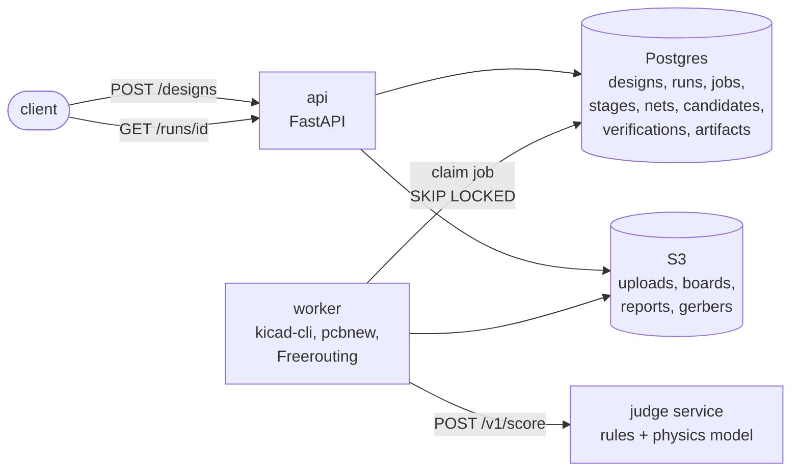

# netlist-pipeline

A KiCad schematic goes in. A fabrication-ready board comes out: placed by search, routed,
scored by a physics judge, verified by KiCad's own design-rule check, exported as Gerbers.
Every stage is a recorded job with a tool version, input hash and output hash, so any run can
be replayed. The judge is a slot: a learned physics model replaces the closed-form reference
behind one HTTP contract, and a golden set decides whether the worker accepts it.

## Architecture



Two containers from one image, a managed Postgres, and a bucket. The API never does work that
takes more than a second: it writes a job row and the worker claims it. The worker runs the
eight stages one job at a time, and the judge stage calls a separate judge service over HTTP.
That service is the model slot.

<details>
<summary><b>Detailed architecture</b>: the stages inside the worker, the judge service and its physics providers, the registry rows and the gate (click to expand; click the image for full size)</summary>


</details>

## The eight stages

```
 1  extract_netlist   kicad-cli ERC + netlist export -> components, nets, nodes
 2  constraints       project net classes + name patterns + constraints.json
 3  build_board       supplied board, or outline + library footprints wired to nets
 4  place             simulated annealing (generate mode only)
 5  route             Freerouting via Specctra DSN/SES (generate mode only)
 6  judge             physics score per candidate; best one chosen   <- the model slot
 7  verify            DRC with schematic parity, IPC-D-356 netlist == schematic, in bounds
 8  export            gerbers, drill, positions, stats, render, report
```

Any stage failure stops the run with the error text. The judge picks the best candidate; only
verify decides whether the run passed. Upload a board you already laid out and the pipeline
skips 4 and 5 and judges and verifies yours instead.

**Stage 4, watched.** The annealer on KiCad's 63-part `pic_programmer` demo: parts start on a
grid and trade wire length against overlap as the temperature falls.


## The output

`pic_programmer`, generated from its schematic alone: three seeds placed and routed, the
judge's pick, DRC-clean, netlist verified against the schematic. About four minutes.


Every run leaves `board.kicad_pcb`, `gerbers.zip`, `drill.zip`, `positions.csv`, `board.png`,
`stats.json` and the judge's `report.json` behind, each with its sha256 in the `artifacts`
table. The run itself is a hash chain: every stage's input hash is an earlier stage's output
hash, drawn here for one run by `scripts/provenance.py`.


## The learned physics model

The judge's rules are fixed. Where the impedance numbers inside them come from is a provider,
and one of the three is a model we trained: `learned-fd v5`, gradient boosting on 5,000
cross-sections solved by our own 2D field solver, answering in microseconds what the solver
answers in a third of a second.


Every step is a row. The dataset names its sampler, solver and seed. The model row names the
dataset, the artifact bytes, the feature encoding, the library version and the commit. The
approval row names the golden set it passed. None of those rows can be edited, and every
verdict the pipeline writes records which bytes produced it.


Three earlier learned judges were refused by the golden gate on a deliberately broken board.
The record is in [docs/experiments](docs/experiments/README.md).

## Run it

```
make up && make migrate        # Postgres + MinIO
make api                       # FastAPI on :8000
make worker                    # the job loop
make demo                      # upload pic_programmer, poll, print the report
make check                     # ruff, mypy strict, unit tests, end-to-end suite
curl -F file=@project.zip 'http://localhost:8000/designs?mode=generate&seeds=3'
```

Needs KiCad 10 and Freerouting locally, or the Dockerfile. Live at
https://netlist-api-ivqr.onrender.com/healthz. Details in [docs/DEPLOY.md](docs/DEPLOY.md).

## Go deeper

- [SPEC.md](SPEC.md): the contract. Stages, constraints format, judge contract, invariants.
- [docs/JUDGE.md](docs/JUDGE.md): the judge slot, the approval gate, the field-solver oracle
  and the learned surrogate that passed it.
- [docs/FACTORY.md](docs/FACTORY.md): where a geometry model's labels would come from.
- [docs/EVAL.md](docs/EVAL.md): search versus the human layout on the fixtures.
- [docs/DECISIONS.md](docs/DECISIONS.md): what was not built and why. No language model runs
  in the pipeline; Claude built the repo.
- [docs/experiments](docs/experiments/README.md): every judge and placer experiment, with
  the ones that failed.
