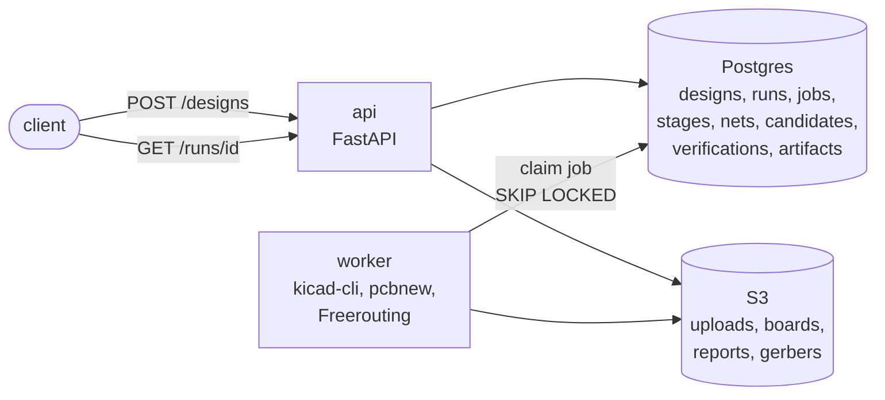
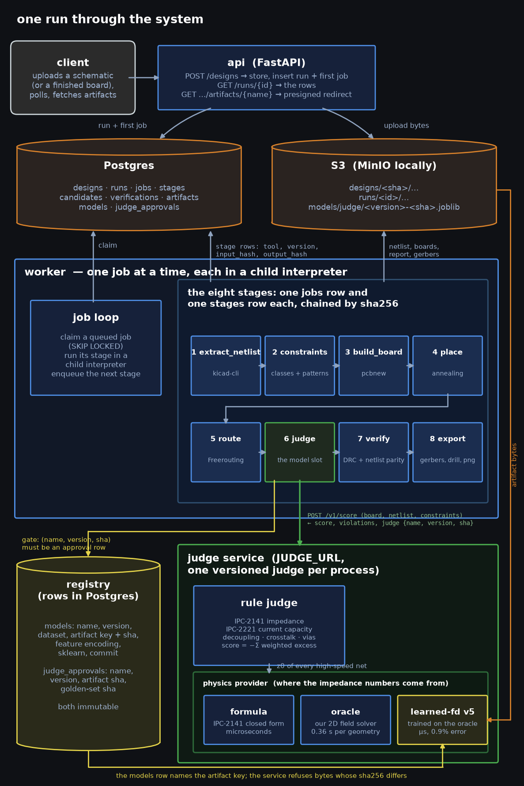
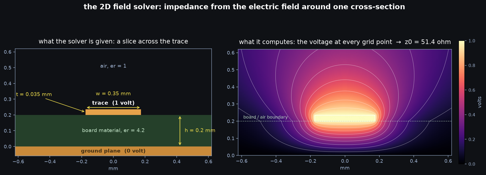
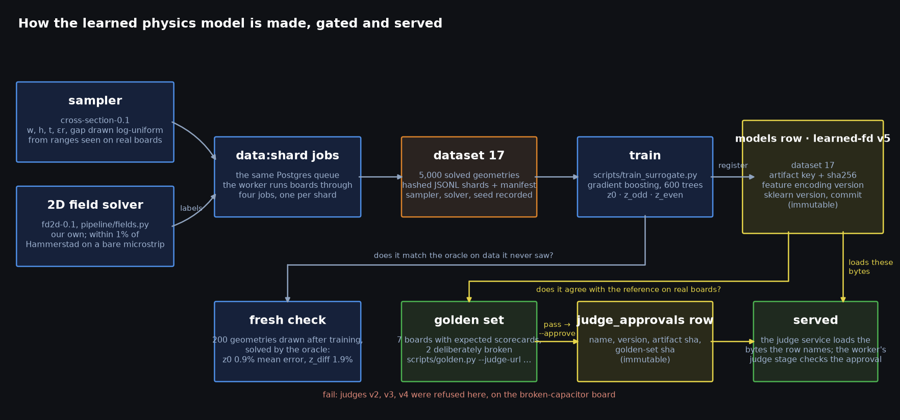
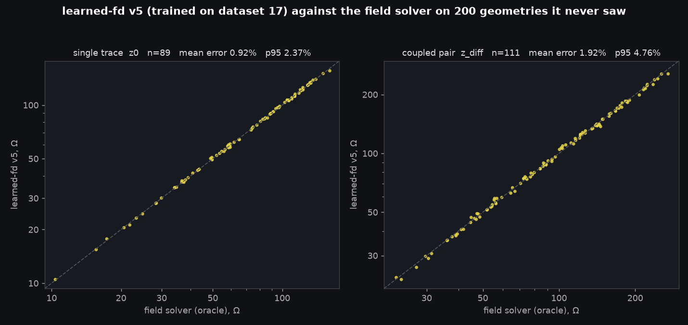

# netlist-pipeline

A KiCad schematic goes in. A fabrication-ready board comes out: placed by search, routed,
scored by a physics judge, verified by KiCad's own design-rule check, exported as Gerbers.
Every stage is a recorded job with a tool version, input hash and output hash, so any run can
be replayed. The judge is a slot: a learned physics model replaces the closed-form reference
behind one HTTP contract, and a golden set decides whether the worker accepts it.

## Architecture



Two containers from one image, a managed Postgres, and a bucket. The API never does work that
takes more than a second: it writes a job row and the worker claims it. The worker runs the
eight stages one job at a time, and the judge stage calls a separate judge service over HTTP.
That service is the model slot.

<details>
<summary>Detailed architecture</summary>



</details>

**Stage 4, watched.** `GET /` on the API is a status board: one row per run, one cell per
stage, and while a run is in `place` it draws the annealer live, parts, rat's nest by net
class and the cost curve, from snapshots the stage writes every 0.1 % of its moves.

## The judge, and the physics model inside it

Everything in this section is about one question: **is this board electrically good?** A board
can have every wire connected and still be bad. This is what the judge measures, why part of
it had to be learned, and how we know the learned part is right.

### 1. What the judge does

After routing, the pipeline has up to ten candidate boards, all wired correctly. The judge
gives each one a score and the best one goes on to verification. The score is a penalty: zero
for a board that breaks no rule, more negative for every rule it breaks and for how badly.

| rule | in plain words | needs physics? |
|---|---|---|
| current | a power trace must be wide enough to carry its current without heating more than 10 °C | textbook formula (IPC-2221) |
| impedance | a high-speed trace must present the impedance the chip expects, 50 Ω by default, within 10 % | **yes** |
| diff pair | the two wires of a differential pair must be the same length within 1 mm | no |
| decoupling | a chip's decoupling capacitor must sit within 10 mm of the pin it serves | no |
| crosstalk | two traces must not run side by side for long stretches with a small gap | no |
| vias | a high-speed trace should change layers at most twice | no |
| unrouted | any connection the router gave up on | no |

Each broken rule costs its weight times how far past the limit it went. A 0.3 mm trace
asked to carry twice what it can costs more than one asked to carry 5 % more. Current and
impedance weigh most, because those are the ones that make a board not work rather than
merely not ideal.

The judge picks the best candidate. It never passes or fails a run; that is verify's job.

### 2. Impedance, and why it is the hard rule

Six of the seven rules are geometry you can measure with a ruler: distance, length, width,
count. Impedance is different.

A fast signal on a trace does not behave like water in a pipe, it behaves like a wave on a
rope. The trace has a characteristic impedance, measured in ohms, and if the chip at the far
end expects 50 Ω and the trace is 90 Ω, part of every edge bounces back and the signal is
corrupted. The impedance is set by four things: how wide the trace is (**w**), how far it sits
above the copper ground plane (**h**), how thick the copper is (**t**), and how strongly the
board material stores electric field, a number called relative permittivity (**er**, about
4.5 for ordinary FR-4 fibreglass). Wider or closer to the plane means lower impedance.

The judge needs this number for every high-speed trace on every candidate. So where does it
come from? That is a separate piece, the **physics provider**, and there are three of them.

### 3. Three ways to get the number

| provider | what it is | one answer takes |
|---|---|---|
| formula | the IPC-2141 closed form, a one-line equation from a standards handbook | a few microseconds |
| field solver | our own program that computes the electric field around the trace, alone or among its neighbours | 0.4 to 1.6 s |
| learned-fd v5 | gradient boosting trained to predict what the solver says for one trace over a plane | under a millisecond |
| learned-cut v8 | a small transformer that reads the whole slice, neighbours and all, and predicts the solver's capacitance matrix | a few milliseconds |

The same three traces through all three, single-ended impedance in ohms:

| trace | formula | field solver | learned-fd v5 |
|---|---|---|---|
| 0.2 mm wide, 1.51 mm above the plane (a signal trace on a plain 2-layer board) | 137.3 | 135.7 | 134.1 |
| 2.9 mm wide, same board (what 50 Ω needs on that board) | 48.1 | 49.1 | 49.1 |
| 0.35 mm wide, 0.2 mm above the plane (a 4-layer board) | 49.0 | 51.4 | 53.0 |

The first row is the finding from run 76: the I2C traces on the generated Raspberry Pi HAT are
0.2 mm wide over a 1.5 mm core, so they sit near 135 Ω against a 50 Ω target, and the judge
flagged both of them.

The formula is quick and usually close, but it is a curve fitted to measurements decades
ago, valid over a limited range of shapes, and it knows nothing about a neighbouring trace or
a missing plane. The field solver is the truth we have. The learned models exist because the
truth is slow.

The first three describe a slice with four numbers and assume a solid plane under the trace.
Boards this pipeline generates have no plane, and only 46 of the 5,206 slices cut from our
real boards do. The fourth provider reads the slice as it is: a list of conductors, each
with its width and distance, and whether a plane is there. Each conductor becomes a token, the
tokens attend to each other with their pairwise gaps built into the attention, and a
symmetric head reads off the full capacitance matrix, the object the solver itself computes.
Impedance and crosstalk coupling are derived from that matrix by the solver's own formula.
Trained on 8,000 synthetic slices plus the real slices of one board family, it predicts the
solver within 1.8 % on a board family it never saw, where gradient boosting on hand-made
features manages 3.5 %. The record, including the run that did not transfer, is in
[docs/experiments/cutnet.md](docs/experiments/cutnet.md).

### 4. The field solver, in plain words

"2D" means the solver never looks at the whole board. Impedance does not depend on how long a
trace is, only on its cross-section, so the solver takes one slice straight across the trace
and works entirely on that slice.



What happens on the slice:

1. **Divide it into a grid.** About 400 cells across and 200 up. Cells are small near the
   trace, where the field changes quickly, and grow larger out towards the edges where
   nothing much happens.
2. **Pin the known voltages.** The trace is held at 1 volt, the ground plane at 0.
3. **Find the voltage everywhere else.** In empty space, each point's voltage is the average of
   its neighbours; at the boundary between air and board material, the average is weighted by
   permittivity. That gives one equation per grid point, about 80,000 of them, all coupled.
   The solver writes them as one sparse matrix and solves it in one shot. The right panel
   above is the result: every grid point's voltage.
4. **Turn the field into capacitance.** A field stores energy, and the energy stored per metre
   of trace tells you the capacitance per metre between trace and plane.
5. **Do it twice.** Once with the real board material and once with the board replaced by air.
   Impedance is set by the two capacitances together, and that pair also gives the speed the
   signal travels at.

For a pair of traces it does the same with the second trace held at +1 V and then at −1 V,
which is what differential pairs and crosstalk need.

The solver was checked against the Hammerstad-Jensen equations, the most trusted closed form
for this shape, and its impedance agrees within 1 % across the range where that form is valid. It takes
about 0.4 s per slice. A board with a dozen high-speed nets, ten candidates, and a search
that wants to score thousands of layouts cannot afford that.

### 5. Teaching a model to imitate the solver

The pattern is: a slow, trusted source of answers produces a dataset; a fast model learns it;
the fast model is checked against the slow one before it is allowed near a real board.



**The dataset.** 5,000 random cross-sections were drawn from the ranges real boards use, and
the solver answered every one. The draws are logarithmic, so thin traces and thin dielectrics,
where impedance changes fastest, are not starved of examples.

| input | range |
|---|---|
| trace width w | 0.1 to 2.0 mm |
| height above plane h | 0.08 to 1.6 mm |
| copper thickness t | 0.018, 0.035 or 0.070 mm, the three foils fabs stock |
| permittivity er | 3.0 to 4.8 |
| gap to a partner trace s | 0.1 to 3.0 mm, present in half the samples |

The work went through the same job queue that builds boards: four jobs of 1,250 slices each,
about two minutes per job on 16 cores. The result is dataset 17: four files plus a manifest
naming the sampler version, solver version and random seed, with the sha256 of every file. The
random seed means the exact same 5,000 slices can be regenerated from scratch.

**The model.** Gradient boosting: 600 small decision trees, each one trained to correct the
mistakes of all the trees before it. The inputs are the four (or five) numbers above, given
to the trees as logarithms, because impedance behaves logarithmically in width and height and
that makes the job easier. There are two models in the artifact: one for single traces
predicting z0, one for pairs predicting the odd- and even-mode impedances that differential
pairs and crosstalk are built from. Training plus the check below took 81 s.

**The first check.** 20 % of the dataset was held back from training and scored afterwards:
0.9 % average error on single-trace impedance. Then 200 brand-new slices were drawn after
training was finished and solved by the solver, so the model was tested on data that did not
exist when it was built:



| target | average error | 95th percentile |
|---|---|---|
| z0, single trace | 0.9 % | 2.4 % |
| z_odd, pair | 2.1 % | 4.2 % |
| z_even, pair | 1.7 % | 3.6 % |

The judge's impedance rule allows 10 %, so the model's error is a small fraction of the
tolerance it is judging against.

### 6. The gate: no model touches a board until it passes

Agreeing with the solver on random slices is not the same as agreeing on real boards. So
every judge version, the formula included, has to pass the **golden set** before the worker
will accept it: seven real boards with known verdicts. Two are deliberately broken copies of
the others, one with a capacitor moved 30 mm so it sits 93 mm from the pin it serves, and one with every +5V trace
thinned to 0.15 mm, and a judge must rank each broken board below its original. Two more
carry high-speed traces with copper, so the impedance rule is actually exercised. The expected
answers come from the field solver.

Three earlier learned judges, v2 through v4, were refused at this gate. They matched the
reference on the ordinary boards and under-penalised the far-capacitor board. They never
reached the worker. The record is in [docs/experiments](docs/experiments/README.md).

Passing writes a row in the `judge_approvals` table naming the judge's name, version, the
sha256 of its model file, and the sha256 of the golden set it passed. The `models` table
already holds the file's location, its dataset, its feature encoding, the library version and
the commit. Neither table can be edited, only added to. Then:

- the judge service loads the model file from S3, hashes the bytes, and refuses to start if the
  hash differs from the row;
- the worker's judge stage asks the service who it is and refuses the run unless that exact
  (name, version, file hash) has an approval row;
- every score the pipeline stores records which bytes produced it.

Swapping a model file, retraining under the same version number, or pointing the worker at an
unapproved judge all fail loudly.

### 7. What it does not know

- **One slice, one layer.** The general solver sees every conductor on the trace's own
  layer and a plane on the next, but not a trace on another layer, vias, or a plane with a
  hole in it. Boards this pipeline generates still have no ground pour, which is why the
  golden answer key had to be recomputed with real slices and why the formula and v5 now
  fail it.
- **No losses, no length.** Copper resistance and dielectric loss are ignored, and nothing
  depends on how long a trace is.
- **Only inside the box.** The model was trained on the ranges in the table above. Outside
  them it extrapolates, and the golden set is what catches that.
- **Simplified rules.** The judge charges nothing for total wire length; [docs/EVAL.md](docs/EVAL.md)
  shows search beating the human layout on this judge while using 73 % more copper.

[docs/FACTORY.md](docs/FACTORY.md) is the plan for the next step: labels from real board
geometry instead of random slices, so a model can learn what a neighbouring trace or a
missing plane does.

## Run it

```
make up && make migrate        # Postgres + MinIO
make api                       # FastAPI on :8000; GET / is a status board: runs, stages, the annealer live
make worker                    # the job loop
make demo                      # upload pic_programmer, poll, print the report
make check                     # ruff, mypy strict, unit tests, end-to-end suite
curl -F file=@project.zip 'http://localhost:8000/designs?mode=generate&seeds=3'
```

Needs KiCad 10 and Freerouting locally, or the Dockerfile. Live at
https://netlist-api-ivqr.onrender.com/healthz. Details in [docs/DEPLOY.md](docs/DEPLOY.md).

## Go deeper

- [SPEC.md](SPEC.md): the contract. Stages, constraints format, judge contract, invariants.
- [docs/JUDGE.md](docs/JUDGE.md): the judge slot, the approval gate, the field-solver oracle
  and the learned surrogate that passed it.
- [docs/FACTORY.md](docs/FACTORY.md): where a geometry model's labels would come from.
- [docs/EVAL.md](docs/EVAL.md): search versus the human layout on the fixtures.
- [docs/DECISIONS.md](docs/DECISIONS.md): what was not built and why. No language model runs
  in the pipeline; Claude built the repo.
- [docs/experiments](docs/experiments/README.md): every judge and placer experiment, with
  the ones that failed.

## How work gets done here

Cards on the Linear board labelled `agent` are picked up by OpenHands, self-hosted on
the lab machine, in a container built from this repo's image; the result is a pull
request with the link back on the card. This repo provides only `AGENTS.md` (the rules every
agent reads) and `make sandbox-image`; the lane itself, what was bought and what was built, and
why research is run differently are in the separate
[agent-lane](https://github.com/azure-eller/agent-lane) repo.

