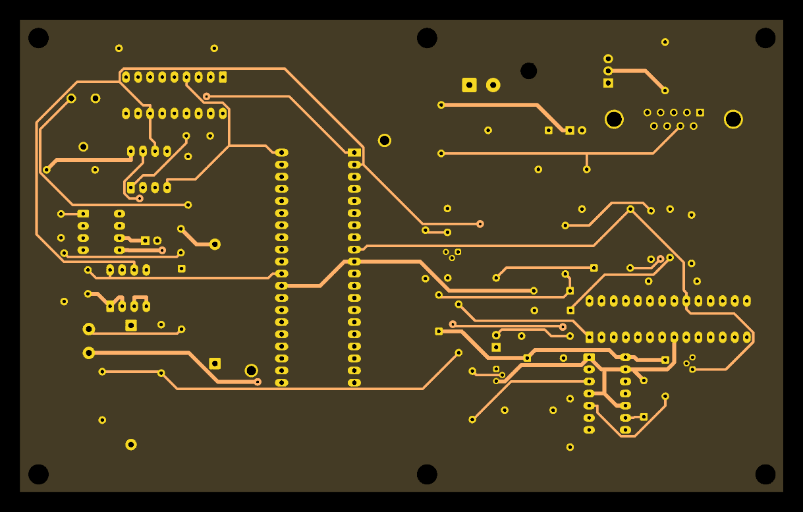

# netlist-pipeline

A KiCad schematic goes in. A fabrication-ready board comes out: placed by search, routed,
scored by a physics judge, verified by KiCad's own design-rule check, exported as Gerbers.
Every stage is a recorded job with a tool version, input hash and output hash, so any run can
be replayed. The judge is a slot: a learned physics model replaces the closed-form reference
behind one HTTP contract, and a golden set decides whether the worker accepts it.

## Architecture


Two containers from one image, a managed Postgres, and a bucket. The API never does work that
takes more than a second: it writes a job row and the worker claims it. The worker runs the
eight stages one job at a time, and the judge stage calls a separate judge service over HTTP.
That service is the model slot.

<details>
<summary>Detailed architecture</summary>


</details>

## The eight stages

Click a box. The numbers are from run 36, `pic_programmer` generated from its schematic with
three seeds.

<details><summary><samp><br>┌───────────────────────────────────────────────────────────┐<br>│&nbsp;&nbsp;1&nbsp;&nbsp;extract_netlist&nbsp;&nbsp;&nbsp;&nbsp;&nbsp;&nbsp;&nbsp;&nbsp;&nbsp;&nbsp;&nbsp;&nbsp;&nbsp;&nbsp;&nbsp;&nbsp;&nbsp;kicad-cli&nbsp;10.0.5&nbsp;&nbsp;&nbsp;&nbsp;&nbsp;&nbsp;│<br>│&nbsp;&nbsp;&nbsp;&nbsp;&nbsp;schematic&nbsp;&nbsp;->&nbsp;&nbsp;63&nbsp;parts,&nbsp;111&nbsp;nets&nbsp;&nbsp;&nbsp;&nbsp;&nbsp;&nbsp;&nbsp;&nbsp;&nbsp;&nbsp;&nbsp;&nbsp;&nbsp;&nbsp;&nbsp;&nbsp;&nbsp;&nbsp;&nbsp;&nbsp;&nbsp;│<br>└─────────────────────────────┬─────────────────────────────┘</samp></summary>

KiCad's own command-line tool reads the schematic and writes the wiring list: every part,
every net, and which pins belong to each net. A net is one group of pins that must end up
connected by copper. The pipeline never works out connectivity from the drawing itself; this
export is the only source. The electrical rules check runs too and is recorded, not enforced,
because template schematics report "errors" that change nothing about the wiring.

```
in   schematic       sha256 cf92bff8ae…
out  netlist.json    sha256 272186ac98…     rows: components, nets, net_nodes
     ERC: 0 errors, 49 warnings
```

</details>
<details><summary><samp><br>&nbsp;&nbsp;&nbsp;&nbsp;&nbsp;&nbsp;&nbsp;&nbsp;&nbsp;&nbsp;&nbsp;&nbsp;&nbsp;&nbsp;&nbsp;&nbsp;&nbsp;&nbsp;&nbsp;&nbsp;&nbsp;&nbsp;&nbsp;&nbsp;&nbsp;&nbsp;&nbsp;&nbsp;&nbsp;&nbsp;▼<br>┌───────────────────────────────────────────────────────────┐<br>│&nbsp;&nbsp;2&nbsp;&nbsp;constraints&nbsp;&nbsp;&nbsp;&nbsp;&nbsp;&nbsp;&nbsp;&nbsp;&nbsp;&nbsp;&nbsp;&nbsp;&nbsp;&nbsp;&nbsp;&nbsp;&nbsp;&nbsp;&nbsp;&nbsp;&nbsp;pipeline&nbsp;0.1.0&nbsp;&nbsp;&nbsp;&nbsp;&nbsp;&nbsp;&nbsp;&nbsp;│<br>│&nbsp;&nbsp;&nbsp;&nbsp;&nbsp;111&nbsp;nets&nbsp;&nbsp;->&nbsp;&nbsp;3&nbsp;power,&nbsp;2&nbsp;high-speed,&nbsp;106&nbsp;default&nbsp;&nbsp;&nbsp;&nbsp;&nbsp;&nbsp;│<br>└─────────────────────────────┬─────────────────────────────┘</samp></summary>

Decide what each net needs. Names like GND and VCC are power rails and must carry current
without heating. Names like CLK or OSC are high-speed and must have a controlled impedance
(50 ohm here). Everything else is default. The classes come from the KiCad project file, then
name patterns, then an optional `constraints.json` in the upload. Each class carries its
targets: 1 A per rail, decoupling capacitor within 10 mm of the chip, a two-layer 1.6 mm board.

```
in   netlist.json    sha256 272186ac98…
out  constraints     sha256 18bdaf2f0f…     row: constraints (source per net)
     GND, VCC from the project file; VCC_PIC, OSC1, OSC2 from name patterns
```

</details>
<details><summary><samp><br>&nbsp;&nbsp;&nbsp;&nbsp;&nbsp;&nbsp;&nbsp;&nbsp;&nbsp;&nbsp;&nbsp;&nbsp;&nbsp;&nbsp;&nbsp;&nbsp;&nbsp;&nbsp;&nbsp;&nbsp;&nbsp;&nbsp;&nbsp;&nbsp;&nbsp;&nbsp;&nbsp;&nbsp;&nbsp;&nbsp;▼<br>┌───────────────────────────────────────────────────────────┐<br>│&nbsp;&nbsp;3&nbsp;&nbsp;build_board&nbsp;&nbsp;&nbsp;&nbsp;&nbsp;&nbsp;&nbsp;&nbsp;&nbsp;&nbsp;&nbsp;&nbsp;&nbsp;&nbsp;&nbsp;&nbsp;&nbsp;&nbsp;&nbsp;&nbsp;&nbsp;pcbnew&nbsp;10.0.5&nbsp;&nbsp;&nbsp;&nbsp;&nbsp;&nbsp;&nbsp;&nbsp;&nbsp;│<br>│&nbsp;&nbsp;&nbsp;&nbsp;&nbsp;63&nbsp;footprints&nbsp;on&nbsp;a&nbsp;160&nbsp;x&nbsp;99&nbsp;mm&nbsp;outline,&nbsp;unplaced&nbsp;&nbsp;&nbsp;&nbsp;&nbsp;&nbsp;│<br>└─────────────────────────────┬─────────────────────────────┘</samp></summary>

Make an empty board with every part on it, wired to its nets but not yet positioned. The
outline comes from the template board, the physical shape of each part (its footprint) from
KiCad's libraries, and pcbnew, KiCad's board engine used as a Python library, writes the file.
The net-class widths and clearances go into a project file that travels with every copy of the
board from here on, because the router reads its rules from there.

If you upload a finished board instead of a schematic, this stage passes it through as the
single candidate and stages 4 and 5 are skipped.

```
in   netlist.json    sha256 a1cf080c27…
out  unplaced board  sha256 6e416e42f4…     + project.kicad_pro
```

</details>
<details><summary><samp><br>&nbsp;&nbsp;&nbsp;&nbsp;&nbsp;&nbsp;&nbsp;&nbsp;&nbsp;&nbsp;&nbsp;&nbsp;&nbsp;&nbsp;&nbsp;&nbsp;&nbsp;&nbsp;&nbsp;&nbsp;&nbsp;&nbsp;&nbsp;&nbsp;&nbsp;&nbsp;&nbsp;&nbsp;&nbsp;&nbsp;▼<br>┌───────────────────────────────────────────────────────────┐<br>│&nbsp;&nbsp;4&nbsp;&nbsp;place&nbsp;&nbsp;&nbsp;&nbsp;&nbsp;&nbsp;&nbsp;&nbsp;&nbsp;&nbsp;&nbsp;&nbsp;&nbsp;&nbsp;&nbsp;&nbsp;&nbsp;&nbsp;&nbsp;&nbsp;&nbsp;&nbsp;&nbsp;&nbsp;&nbsp;&nbsp;&nbsp;simulated&nbsp;annealing&nbsp;&nbsp;&nbsp;│<br>│&nbsp;&nbsp;&nbsp;&nbsp;&nbsp;3&nbsp;seeds&nbsp;&nbsp;->&nbsp;&nbsp;3&nbsp;candidate&nbsp;layouts,&nbsp;about&nbsp;a&nbsp;minute&nbsp;each&nbsp;│<br>└─────────────────────────────┬─────────────────────────────┘</samp></summary>

Parts start on a grid. Over 85,000 rounds the placer picks a part, moves it or swaps it with
another, and scores the result: total wire length, decoupling capacitors near their chips, no
overlaps, nothing outside the outline. Better moves are kept. Worse moves are sometimes kept
too, often at the start and rarely at the end, which is the "temperature" and is what stops
the search from settling into the first mediocre arrangement it finds. Each seed is a
different random start, so three seeds give three different boards.


```
in   unplaced board  sha256 6e416e42f4…
out  3 placed boards sha256 2e3c916091…     rows: candidates 1, 2, 3
     cost  seed 1: 5306   seed 2: 6133   seed 3: 5651   (lower is better)
```

</details>
<details><summary><samp><br>&nbsp;&nbsp;&nbsp;&nbsp;&nbsp;&nbsp;&nbsp;&nbsp;&nbsp;&nbsp;&nbsp;&nbsp;&nbsp;&nbsp;&nbsp;&nbsp;&nbsp;&nbsp;&nbsp;&nbsp;&nbsp;&nbsp;&nbsp;&nbsp;&nbsp;&nbsp;&nbsp;&nbsp;&nbsp;&nbsp;▼<br>┌───────────────────────────────────────────────────────────┐<br>│&nbsp;&nbsp;5&nbsp;&nbsp;route&nbsp;&nbsp;&nbsp;&nbsp;&nbsp;&nbsp;&nbsp;&nbsp;&nbsp;&nbsp;&nbsp;&nbsp;&nbsp;&nbsp;&nbsp;&nbsp;&nbsp;&nbsp;&nbsp;&nbsp;&nbsp;&nbsp;&nbsp;&nbsp;&nbsp;&nbsp;&nbsp;Freerouting&nbsp;2.4.1&nbsp;&nbsp;&nbsp;&nbsp;&nbsp;│<br>│&nbsp;&nbsp;&nbsp;&nbsp;&nbsp;3&nbsp;candidates,&nbsp;in&nbsp;parallel&nbsp;&nbsp;->&nbsp;&nbsp;17&nbsp;to&nbsp;25&nbsp;s&nbsp;each&nbsp;&nbsp;&nbsp;&nbsp;&nbsp;&nbsp;&nbsp;&nbsp;│<br>└─────────────────────────────┬─────────────────────────────┘</samp></summary>

Draw the copper. Each placed board is exported in Specctra DSN, a board format the open-source
autorouter Freerouting reads, routed for up to 20 passes, and the resulting traces read back
into the board. Seeds run as separate processes at the same time. A connection the router
could not finish is counted, not hidden.

```
in   placed board 1  sha256 d976c6f121…
out  3 routed boards sha256 2507223bac…     candidates updated
     seed 1: 24.8 s, 2 unrouted   seed 2: 17.0 s, 0   seed 3: 18.5 s, 0
```

</details>
<details><summary><samp><br>&nbsp;&nbsp;&nbsp;&nbsp;&nbsp;&nbsp;&nbsp;&nbsp;&nbsp;&nbsp;&nbsp;&nbsp;&nbsp;&nbsp;&nbsp;&nbsp;&nbsp;&nbsp;&nbsp;&nbsp;&nbsp;&nbsp;&nbsp;&nbsp;&nbsp;&nbsp;&nbsp;&nbsp;&nbsp;&nbsp;▼<br>┌───────────────────────────────────────────────────────────┐<br>│&nbsp;&nbsp;6&nbsp;&nbsp;judge&nbsp;&nbsp;&nbsp;&nbsp;&nbsp;&nbsp;&nbsp;&nbsp;&nbsp;&nbsp;&nbsp;&nbsp;&nbsp;&nbsp;&nbsp;&nbsp;&nbsp;&nbsp;&nbsp;&nbsp;&nbsp;&nbsp;&nbsp;&nbsp;&nbsp;&nbsp;&nbsp;rules&nbsp;0.1.0&nbsp;&nbsp;&nbsp;&nbsp;&nbsp;&nbsp;&nbsp;&nbsp;&nbsp;&nbsp;&nbsp;│───&nbsp;POST&nbsp;/v1/score&nbsp;──>&nbsp;judge&nbsp;service<br>│&nbsp;&nbsp;&nbsp;&nbsp;&nbsp;3&nbsp;candidates&nbsp;&nbsp;->&nbsp;&nbsp;seed&nbsp;2&nbsp;chosen,&nbsp;score&nbsp;-1.20&nbsp;&nbsp;&nbsp;&nbsp;&nbsp;&nbsp;&nbsp;&nbsp;&nbsp;&nbsp;│<br>└─────────────────────────────┬─────────────────────────────┘</samp></summary>

Each routed board goes over HTTP to the judge service, which returns a score and a list of
violations. Before trusting it, the worker checks that the judge's name, version and model
fingerprint appear in the approvals table; a judge that never passed the golden set stops
the run. The score is zero minus a weighted sum of every rule excess: a trace too thin for
its current, a high-speed trace off its impedance, a capacitor too far from its chip. A board
with unrouted connections never beats a fully routed one. The best board is marked chosen.

```
in   routed board 2  sha256 7303c048db…
out  report.json     sha256 113f23fcb7…     candidates.score, candidates.chosen
     seed 1: -1.60 (2 unrouted)   seed 2: -1.20 chosen   seed 3: -2.81
     violations on the winner:
       decoupling  C1 is 15.96 mm from the nearest IC pin on VCC (limit 10 mm)
       current     VCC_PIC at 0.3 mm carries 1.00 A, needs 1.0 A
```

</details>
<details><summary><samp><br>&nbsp;&nbsp;&nbsp;&nbsp;&nbsp;&nbsp;&nbsp;&nbsp;&nbsp;&nbsp;&nbsp;&nbsp;&nbsp;&nbsp;&nbsp;&nbsp;&nbsp;&nbsp;&nbsp;&nbsp;&nbsp;&nbsp;&nbsp;&nbsp;&nbsp;&nbsp;&nbsp;&nbsp;&nbsp;&nbsp;▼<br>┌───────────────────────────────────────────────────────────┐<br>│&nbsp;&nbsp;7&nbsp;&nbsp;verify&nbsp;&nbsp;&nbsp;&nbsp;&nbsp;&nbsp;&nbsp;&nbsp;&nbsp;&nbsp;&nbsp;&nbsp;&nbsp;&nbsp;&nbsp;&nbsp;&nbsp;&nbsp;&nbsp;&nbsp;&nbsp;&nbsp;&nbsp;&nbsp;&nbsp;&nbsp;kicad-cli&nbsp;10.0.5&nbsp;&nbsp;&nbsp;&nbsp;&nbsp;&nbsp;│<br>│&nbsp;&nbsp;&nbsp;&nbsp;&nbsp;DRC&nbsp;0&nbsp;errors,&nbsp;netlist&nbsp;matches,&nbsp;in&nbsp;bounds&nbsp;&nbsp;->&nbsp;&nbsp;passed&nbsp;&nbsp;│<br>└─────────────────────────────┬─────────────────────────────┘</samp></summary>

The only stage that decides pass or fail, and it uses KiCad's own checks, not ours. The
design-rule check runs on the chosen board with schematic parity on, so the board is compared
against the schematic it came from. Then the board's netlist is exported in IPC-D-356, a
fabrication test format, and compared pin by pin with the schematic's netlist from stage 1.
Then every part's courtyard must sit inside the outline. Silkscreen clashes are counted and
reported but do not fail the run, since fabs clip silk over copper anyway.

```
in   routed board 2  sha256 7303c048db…
out  verdict         sha256 668b0f219e…     row: verifications
     errors 0   unrouted 0   netlist match   in bounds   34 silkscreen clashes recorded
```

</details>
<details><summary><samp><br>&nbsp;&nbsp;&nbsp;&nbsp;&nbsp;&nbsp;&nbsp;&nbsp;&nbsp;&nbsp;&nbsp;&nbsp;&nbsp;&nbsp;&nbsp;&nbsp;&nbsp;&nbsp;&nbsp;&nbsp;&nbsp;&nbsp;&nbsp;&nbsp;&nbsp;&nbsp;&nbsp;&nbsp;&nbsp;&nbsp;▼<br>┌───────────────────────────────────────────────────────────┐<br>│&nbsp;&nbsp;8&nbsp;&nbsp;export&nbsp;&nbsp;&nbsp;&nbsp;&nbsp;&nbsp;&nbsp;&nbsp;&nbsp;&nbsp;&nbsp;&nbsp;&nbsp;&nbsp;&nbsp;&nbsp;&nbsp;&nbsp;&nbsp;&nbsp;&nbsp;&nbsp;&nbsp;&nbsp;&nbsp;&nbsp;kicad-cli&nbsp;10.0.5&nbsp;&nbsp;&nbsp;&nbsp;&nbsp;&nbsp;│<br>│&nbsp;&nbsp;&nbsp;&nbsp;&nbsp;gerbers,&nbsp;drill,&nbsp;positions,&nbsp;stats,&nbsp;render,&nbsp;report&nbsp;&nbsp;&nbsp;&nbsp;&nbsp;&nbsp;│<br>└───────────────────────────────────────────────────────────┘</samp></summary>

Everything a fab house and an assembler need, from the chosen board. Gerbers are the
per-layer drawings of copper, mask and silk. The drill file lists every hole. The positions
file tells a pick-and-place machine where each part goes. Each file is stored in S3 with its
size and sha256 in the `artifacts` table, and the API hands out a signed link to any of them.

```
in   routed board 2  sha256 7303c048db…
out  gerbers.zip     sha256 df0f63acde…
     board.kicad_pcb 386 KB   gerbers.zip 86 KB   drill.zip 2 KB   positions.csv 6 KB
     board.png 82 KB   stats.json 3 KB   report.json 4 KB
```

</details>

## The output

`pic_programmer`, generated from its schematic alone: three seeds placed and routed, the
judge's pick, DRC-clean, netlist verified against the schematic. About four minutes.



Every run leaves `board.kicad_pcb`, `gerbers.zip`, `drill.zip`, `positions.csv`, `board.png`,
`stats.json` and the judge's `report.json` behind, each with its sha256 in the `artifacts`
table. The run itself is a hash chain: every stage's input hash is an earlier stage's output
hash, drawn here for one run by `scripts/provenance.py`.


## The learned physics model

The judge's rules are fixed. Where the impedance numbers inside them come from is a provider,
and one of the three is a model we trained: `learned-fd v5`, gradient boosting on 5,000
cross-sections solved by our own 2D field solver, answering in microseconds what the solver
answers in a third of a second.


Every step is a row. The dataset names its sampler, solver and seed. The model row names the
dataset, the artifact bytes, the feature encoding, the library version and the commit. The
approval row names the golden set it passed. None of those rows can be edited, and every
verdict the pipeline writes records which bytes produced it.


Three earlier learned judges were refused by the golden gate on a deliberately broken board.
The record is in [docs/experiments](docs/experiments/README.md).

## Run it

```
make up && make migrate        # Postgres + MinIO
make api                       # FastAPI on :8000
make worker                    # the job loop
make demo                      # upload pic_programmer, poll, print the report
make check                     # ruff, mypy strict, unit tests, end-to-end suite
curl -F file=@project.zip 'http://localhost:8000/designs?mode=generate&seeds=3'
```

Needs KiCad 10 and Freerouting locally, or the Dockerfile. Live at
https://netlist-api-ivqr.onrender.com/healthz. Details in [docs/DEPLOY.md](docs/DEPLOY.md).

## Go deeper

- [SPEC.md](SPEC.md): the contract. Stages, constraints format, judge contract, invariants.
- [docs/JUDGE.md](docs/JUDGE.md): the judge slot, the approval gate, the field-solver oracle
  and the learned surrogate that passed it.
- [docs/FACTORY.md](docs/FACTORY.md): where a geometry model's labels would come from.
- [docs/EVAL.md](docs/EVAL.md): search versus the human layout on the fixtures.
- [docs/DECISIONS.md](docs/DECISIONS.md): what was not built and why. No language model runs
  in the pipeline; Claude built the repo.
- [docs/experiments](docs/experiments/README.md): every judge and placer experiment, with
  the ones that failed.
